# Praca inżynierska (12.2022)

Proponowanym sposobem na uruchomienie aplikacji jest odpalenie komendy `docker-compose up` w folderze kod.
Po uruchomieniu kontenerów, aplikacja kliencka będzie dostępna pod adresem http://localhost:3000.

Przy starcie aplikacji ładowane są do bazy danych przykładowe dane m.in. następujące konta użytkowników:
| Login 		| Hasło       | Role                              							|
|---------------|-------------|-------------------------------------------------------------|
| kamil 		| KamilKamil1 | Użytkownik, Zalogowany użytkownik 							|
| administrator | KamilKamil1 | Użytkownik, Zalogowany użytkownik, Administrator 			|
| adam 			| KamilKamil1 | Użytkownik, Zalogowany użytkownik 							|
| reviewer 		| KamilKamil1 | Użytkownik, Zalogowany użytkownik, Recenzent 				|
| adminreviewer | KamilKamil1 | Użytkownik, Zalogowany użytkownik, Recenzent, Administrator |

## Temat:

### Po polsku:
Aplikacja internetowa do gromadzenia i udostępniania informacji o technologiach programistycznych

### Po angielsku:
A web application for gathering and sharing information about software development

## Wstęp
Praca inżynierska została zrealizowana na Politechnice Wrocławskiej. Genezą tego tematu jest analiza kilku popularnych serwisów informacyjnych typu Wikipedia, Medium oraz dokumentacje.

Główne wnioski dotyczące Wikipedii:
* Wikipedia jest serwisem dotyczącym wielu dziedzin i przez to często znajdują się tam treści zbyt ogólne,
* Sekcja komentarzy jest mocno nieczytelna oraz nie ma standardowego mechanizmu opiniowania np. w postaci gwiazdek,
* Zbyt mało kryteriów wyszukiwania,
* Czytelne i ładne artykuły,
* Artykuły posiadają podobną budowę (jednolita stylistyka strony),
* Rozbudowany formularz tworzenia i edycji artykułów,
* Ogólnie mało rozbudowana warstwa społecznościowa.

Główne wnioski dotyczące Medium:
* Ładne i czytelne artykuły,
* Rozbudowany system wyszukiwania artykułów,
* Czytelna sekcja z komentarzami,
* Ogólnie rozbudowana forma społecznościowa,
* Artykuły mogą się mocno różnić stylistycznie,
* Zbyt prosty formularz tworzenia artykułów,
* Zbyt mały zakres wystawianych ocen - jedynie jednostopniowa pochwała,
* Wymagane konto premium do wyświetlenia wszystkich artykułów,
* Brak obowiązkowego tekstowego uzasadnienia opinii dotyczącej artukułu.

Dokumentacja (np. specyfikacja języka Java w wersji 17):
* Zbyt szczegółowe treści,
* Rzadko kiedy można natrafić na przykłady,
* Brak warstwy społecznościowej.

Po analizie zauważono, że jest deficyt serwisów informacyjnych będących pomiędzy Wikipedią, Medium oraz dokumentacjami biorąc pod uwagę sczegółowość dostarczanych treści oraz takich serwisów, które mają rozbudowaną warstwę społecznościową. Niniejsza praca jest próbą stworzenia systemu o charakterze społecznościowym, który będzie umożliwiał zamieszczanie treści wyłącznie o technologiach programistycznych. Publikowane treści będą bardziej szczegółowe niż jest to w przypadku informacji encyklopedycznych, ale również treści te nie będą zbyt szczegółowe i dzięki temu będą one zrozumiałe oraz wartościowsze dla przeciętnego użytkownika. Dodatkowo zostanie położony nacisk na stworzenie rozbudowanej warstwy społecznościowej.

## Cel projektu
Celem pracy jest zaprojektowanie i implementacja responsywnej aplikacji webowej IT Tech, która będzie umożliwiała użytkownikom tworzenie artykułów o technologiach programistycznych (np. dotyczących języków programowania), przeglądanie dostępnych artykułów oraz zostawienie informacji zwrotnej o artykule w postaci komentarza lub opinii. Artykuły będą mogły być wyszukiwane po wielu kryteriach, będzie rozbudowany system opinii, prosty i intuicyjny interfejs użytkownika oraz treści opublikowane w serwisie będą dostępne dla każdego użytkownika. Realizowana aplikacja będzie umożliwiała szybkie zamieszczanie treści każdemu użytkownikowi i dzięki temu możliwe będzie dostarczanie treści aktualnych oraz nadążanie za trendami. Aplikacja będzie rozwiązaniem pośrednim między dokumentacjami oraz serwisami informacyjnymi obejmującymi wiele dziedzin. Nie będzie nacisku na dużą szczegółowość zamieszczanych treści oraz serwis będzie zorientowany jedynie na technologie programistyczne i przez to treści nie będą przez to zbyt ogólne.

## Plan projektu:
* Projekt:
    * Zdefiniowanie wymagań funkcjonalnych i niefunkcjonalnych,
    *Sporządzenie diagramów i opisów przypadków użycia,
    * Zrobienie widoków interfejsów użytkownika,
    * Utworzenie schematów bazy danych.
* Implementacja:
    * Aplikacja serwerowa,
    * Aplikacja kliencka,
    * Uwierzytelnianie i autoryzacja
* Testy integracyjne backendu,
* Wdrożenie,
* Opracowanie dokumentacji.

## Role użytkowników:
* Użytkownik - każdy użytkownik korzystający z serwisu. Może on jedynie przeglądać zasoby
serwisu,
* Niezalogowany użytkownik - niezalogowany użytkownik mający możliwość przeglądania zasobów serwisu oraz może się zarejestrować i zalogować,
* Zalogowany użytkownik - każdy zarejestrowany i zalogowany użytkownik. Może on przede wszystkim przeglądać i tworzyć artykuły oraz wystawiać komentarze i opinie o artykułach,
* Autor artykułu - zalogowany użytkownik mogący edytować oraz usuwać utworzone przez siebie artykuły,
* Autor komentarza o artykule - zalogowany użytkownik mogący edytować oraz usuwać utworzone przez siebie komentarze o artykule,
* Autor opinii o artykule - zalogowany użytkownik mogący edytować oraz usunąć utworzoną przez siebie opinię o artykule,
* Autor akceptacji opinii o artykule - zalogowany użytkownik mogący usunąć utworzoną przez siebie akceptację opinii o artykule,
* Recenzent (ekspert od technologii) - zalogowany użytkownik, który otrzymał od administratora rolę recenzenta. Jego głównym zadaniem jest weryfikacja artykułów przed ich opublikowaniem w serwisie. Innym uprawnieniem tego użytkownika jest m.in. zarządzanie klasyfikacją technologii.
* Administrator (utrzymuje porządek w serwisie) - zalogowany użytkownik, który otrzymał
od innego administratora rolę administratora. Odpowiada on przede wszystkim za przydzielanie ról użytkownikom oraz utrzymywanie porządku w serwisie poprzez edytowanie i usuwanie niewłaściwych treści (np. wirusy lub spam). Przy instalacji systemu powinno być tworzone
co najmniej jedno konto użytkownika z rolą administratora, gdyż to właśnie administrator odpowiada za przydzielanie ról innym użytkownikom,
* System - wbudowane procedury będące uruchomione na osobnym wątku, które umożliwiają automatyczne przypisywanie recenzenta do weryfikacji artykułów oraz automatyczne ponowne przypisanie artykułu do weryfikacji innemu recenzentowi, jeśli upłynął 1-tygodniowy termin weryfikacji artykułu przeprowadzanej przez aktualnego recenzenta.

<p align="center">
    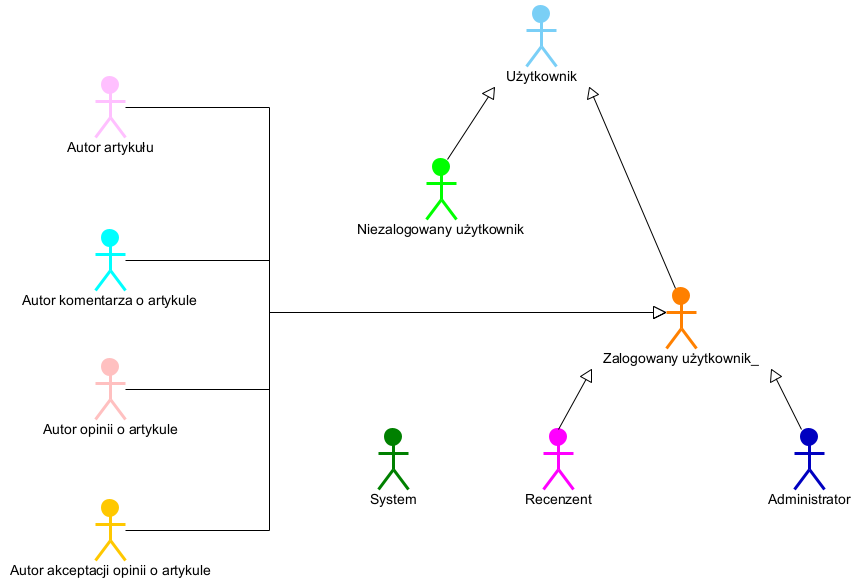
</p>

## Wymagania funkcjonalne:
* Użytkownik:
    * Wyszukiwanie i sortowanie artykułów,
    * Wyświetlenie zawartości artykułu,
    * Przeglądania komentarzy o artykule,
    * Przeglądanie opinii o artykule,
    * Wyszukiwanie technologi (nie wystarczyło czasu),
    * Sortowanie technologi (nie wystarczyło czasu),
    * Wyświetlenie opisu technologii.
* Niezalogowany użytkownik:
    * Rejestracja,
    * Zalogowanie się.
* Zalogowany użytkownik:
    * Edycja własnych danych,
    * Zmiana hasła,
    * Wylogowanie się,
    * Utworzenie artykułu,
    * Dodanie opinii o artykule,
    * Ocenienie opinii o artykule zostawionej przez innego użytkownika.
* Autor artykułu:
    * Edycja własnego artykułu,
    * Usunięcie własnego artykułu.
* Autor komentarza o artykule:
    * Edycja własnego komentarza,
    * Usunięcie własnego komentarza.
* Autor opinii o artykule:
    * Edycja własnej opinii,
    * Usunięcie własnej opinii.
* Autor akceptacji opinii o artykule:
    * Usunięcie własnej akceptacji opinii.
* Recenzent:
    * Edycja drzewka technologii (zabrakło czasu),
    * Ustawienie własnej dostępności,
    * Weryfikacja artykułów.
* Administrator:
    * Edycja danych innych użytkowników,
    * Edytowanie i usuwanie artykułów,
    * Usuwanie komentarzy o artykule,
    * Usuwanie opinii o artykule,
    * Przypisywanie innym użytkownikom ról,
    * Usuwanie przypisania ról innym użytkownikom.
* System co 24 godziny:
    * Przypisuje artykuły do weryfikacji dostępnym recenzentom, którzy w ciągu ostatnich 30 dni zrecenzowali        najmniejszą liczbę artykułów,
    * Wyszukuje artykuły z przedawnioną weryfikacją,
    * Usuwa przedawnione weryfikacje artykułów oraz przypisuje artykuły do ponownej weryfikacji.
    
Wymagania funkcjonalne dobrze ilustruje cykl życia artykułu:
<p align="center">
    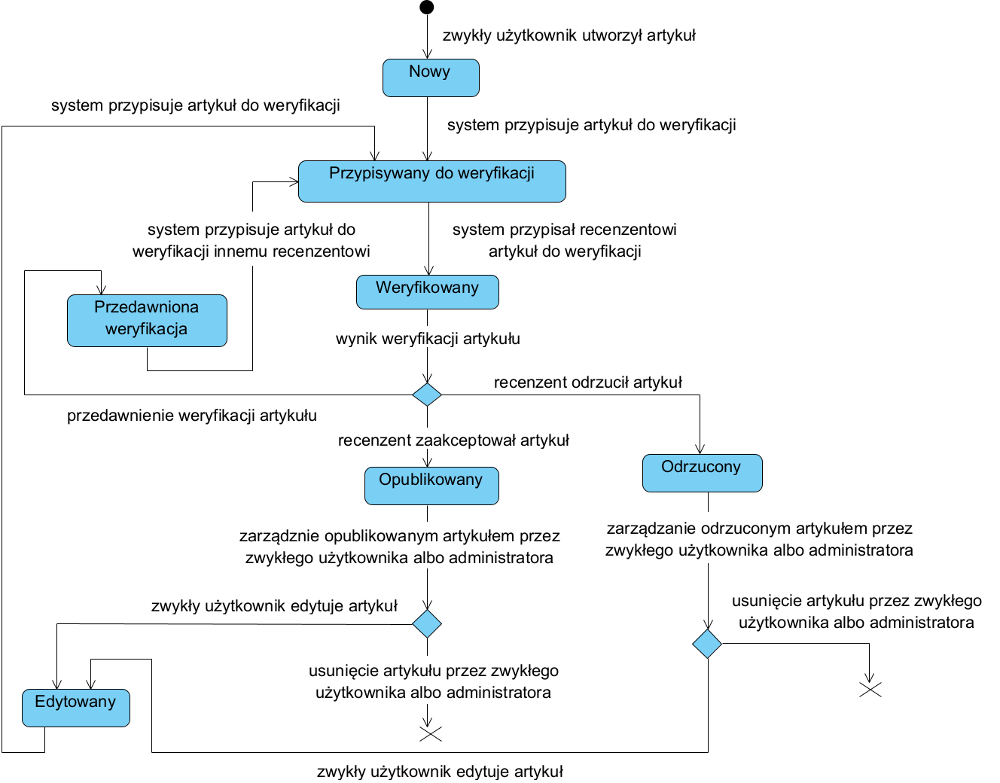
</p>

### Diagram przypadków użycia dla każdego użytkownika:
<p align="center">
    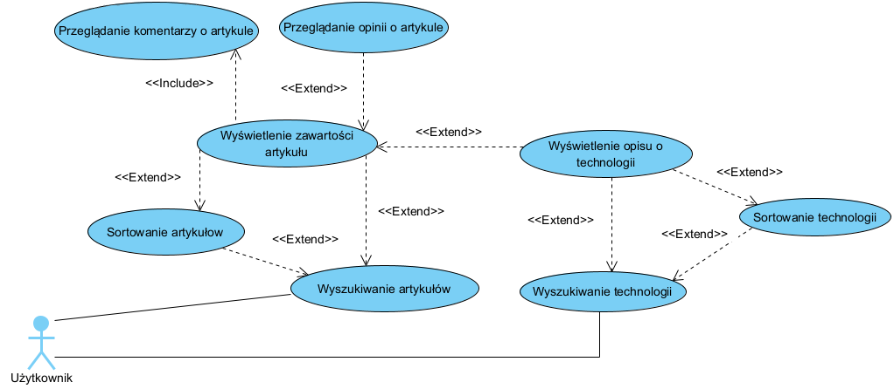
</p>

### Diagram przypadków użycia dla niezalogowanego użytkownika:
<p align="center">
    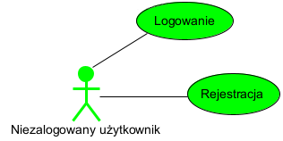
</p>

### Diagram przypadków użycia dla zalogowanego użytkownika:
<p align="center">
    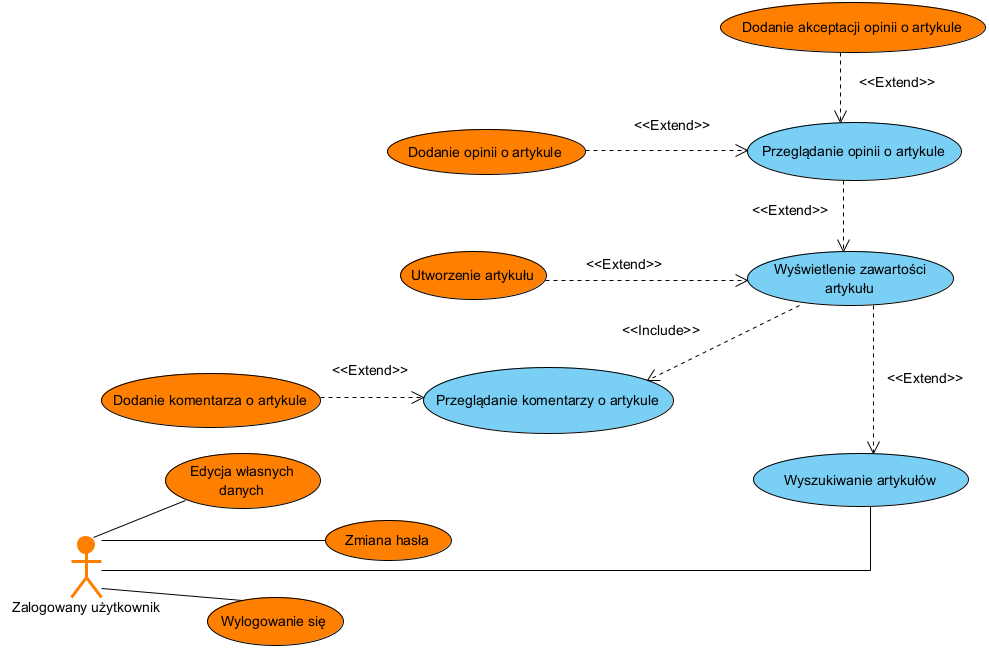
</p>

### Diagram przypadków użycia dla recenzenta:
<p align="center">
    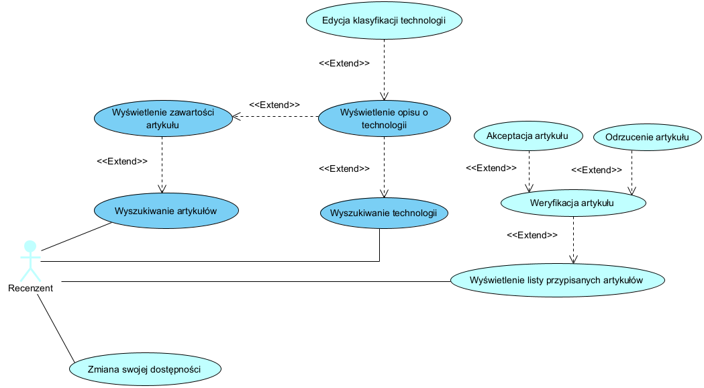
</p>

### Diagram przypadków użycia dla administratora:
<p align="center">
    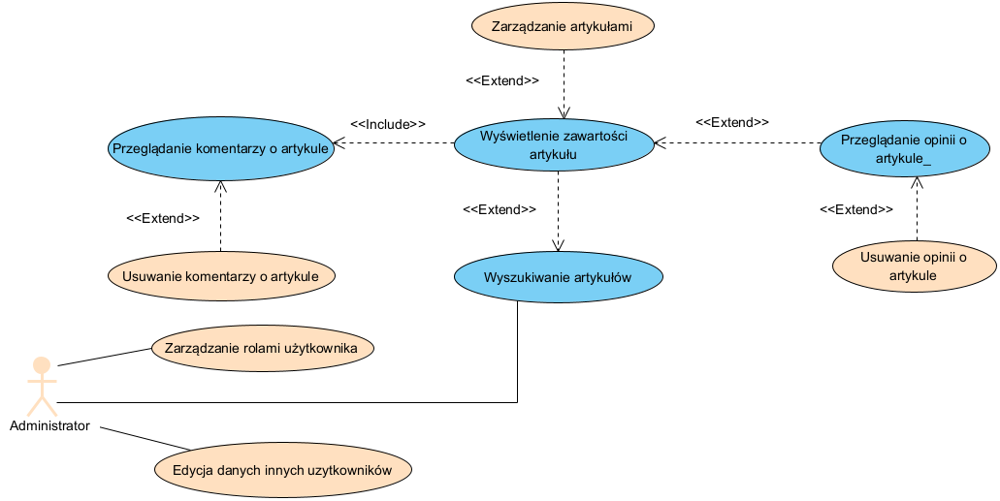
</p>

### Diagram przypadków użycia dla systemu:
<p align="center">
    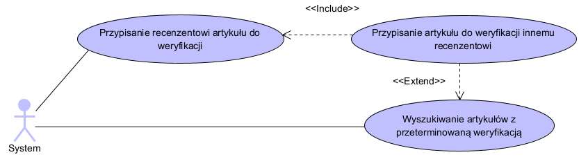
</p>

## Wymagania niefunkcjonalne:
* Wymagania dotyczące bezpieczeństwa systemu:
    * Zewnętrzny serwer do uwierzytelniania i autoryzacji,
    * Autoryzacja oparta na Bearer tokenie,
    * Wymogi dotyczące hasła:
        * min. 8 znaków, 
        * min. 1 mała litera, 
        * min. 1 duża litera, 
        * min. 1 cyfra.
* Wykorzystywane technologie:
* Aplikacja kliencka:
	* Biblioteka do tworzenia UI - React (JavaScript),
	* Statyczne typowanie - TypeScript,
	* Biblioteka komponentów - MUI,
	* Globalny stan aplikacji - Redux,
	* IDE - Visual Studio Code.
* Aplikacja serwerowa:
	* Główny język - Java,
	* Framework - Spring / Spring Boot (Java),
	* Środowisko - Itellij.
* Baza danych:
	* Główna baza danych - PostgreSQL,
	* Baza danych artykułów - MongoDB.
* Testowanie:
	* Testy integracyjne oraz jednostkowe - JUnit, REST-assured,
	* Manualne testowanie wysyłania zapytań do serwerów - Postman.
* Wdrożenie:
	* Baza danych artykułów - MongoDB Atlas,
	* Reszta aplikacji  - Azure,
	* Serwer webowy - Nginx,
	* Docker,
	* Docker Compose.
* Pozostałe:
	* Warstwa bezpieczeństwa - Keycloak,
	* Komunikacja między komponentami systemu - REST,
	* Sporządzenie diagramów UML oraz ERD - Visual Paradigm,
	* Projekt interfejsu użytkownika - Figma,
	* Dokumentacja/Praca inżynierska - LaTeX.

## Architektura systemu
<p align="center">
    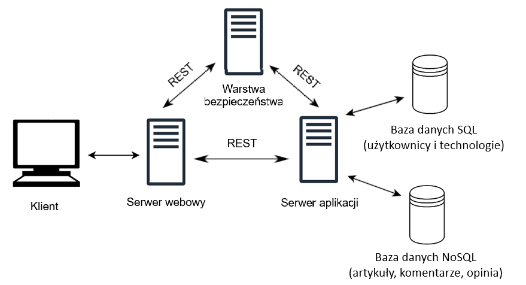
</p>

Zdecydowano się na bazę danych NoSQL opartą na dokumentach, gdyż artykuły, komentarze i opinie charakteryzuje duże zagnieżdżenie np. do jednego komentara może odnieść się wiele osób. Reszta danych zawiera wiele relacji i dlatego też zdecydowano się zastosować dla nich bazę SQL.

## Architektura systemu z przydzielonymi technologiami:
<p align="center">
    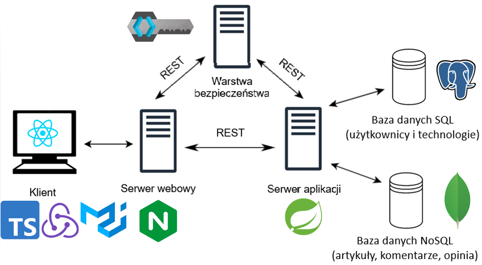
</p>


## Diagram ERD bazy SQL:
<p align="center">
    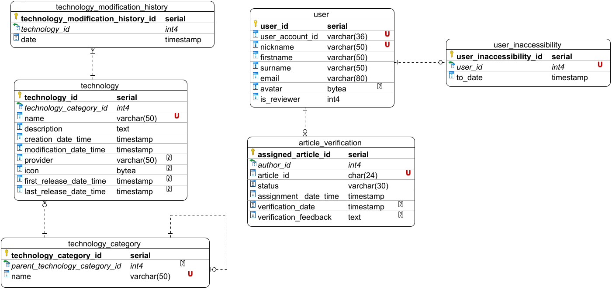
</p>

## Schematy bazy NoSQL:

Schemat artykułu:
```json
{
   "$jsonSchema":{
      "bsonType":"object",
      "title":"articles",
      "required":[
         "authorId",
         "technologyCategoryId",
         "title",
         "content",
         "status",
         "creationDate",
         "modificationDate"
      ],
      "properties":{
         "_id":{
            "bsonType":"objectId"
         },
         "authorId":{
            "bsonType":"int"
         },
         "technologyCategoryId":{
            "bsonType":"int"
         },
         "title":{
            "bsonType":"string",
            "uniqueItems":true
         },
         "content":{
            "bsonType":"string"
         },
         "status":{
            "bsonType":"string",
            "enum":[
               "_new",
               "assigning_to_verification",
               "verification",
               "expired_verification",
               "refused",
               "published",
               "editing"
            ]
         },
         "creationDate":{
            "bsonType":"date"
         },
         "modificationDate":{
            "bsonType":"date"
         },
         "averageRating":{
            "bsonType":"double"
         }
      }
   }
}
```

Schemat komentarza:
```json
{
   "$jsonSchema":{
      "bsonType":"object",
      "title":"comments",
      "required":[
         "author_id",
         "content",
         "creationDate",
         "modificationDate"
      ],
      "properties":{
         "_id":{
            "bsonType":"objectId"
         },
         "author_id":{
            "bsonType":"int"
         },
         "content":{
            "bsonType":"string"
         },
         "creationDate":{
            "bsonType":"timestamp"
         },
         "modificationDate":{
            "bsonType":"timestamp"
         },
         "comments":{
            "bsonType":"array",
            "items":{
               "bsonType":"object"
            }
         }
      }
   }
}
```

Schemat opinii:
```json
{
   "$jsonSchema":{
      "bsonType":"object",
      "title":"opinion",
      "required":[
         "author_id",
         "rating",
         "content",
         "creationDate",
         "modificationDate",
         "positiveAcceptancesCount",
         "negativeAcceptancesCount"
      ],
      "properties":{
         "_id":{
            "bsonType":"objectId"
         },
         "author_id":{
            "bsonType":"int"
         },
         "rating":{
            "bsonType":"int",
            "minimum":1,
            "maximum":5
         },
         "content":{
            "bsonType":"string"
         },
         "creationDate":{
            "bsonType":"timestamp"
         },
         "modificationDate":{
            "bsonType":"timestamp"
         },
         "acceptances":{
            "bsonType":"array",
            "items":{
               "bsonType":"object",
               "required":[
                  "author_id",
                  "value"
               ],
               "properties":{
                  "_id":{
                     "bsonType":"objectId"
                  },
                  "author_id":{
                     "bsonType":"int"
                  },
                  "value":{
                     "bsonType":"int",
                     "enum":[
                        -1,
                        1
                     ]
                  }
               }
            }
         },
         "positiveAcceptancesCount":{
            "bsonType":"int",
            "minimum":0
         },
         "negativeAcceptancesCount":{
            "bsonType":"int",
            "minimum":0
         }
      }
   }
}
```

## Specyfikacja API:
<p align="center">
    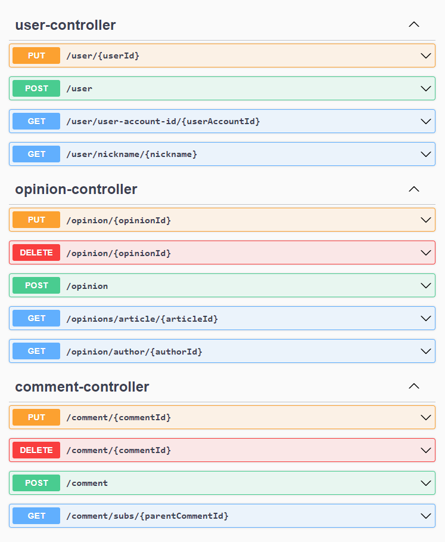
</p>

<p align="center">
    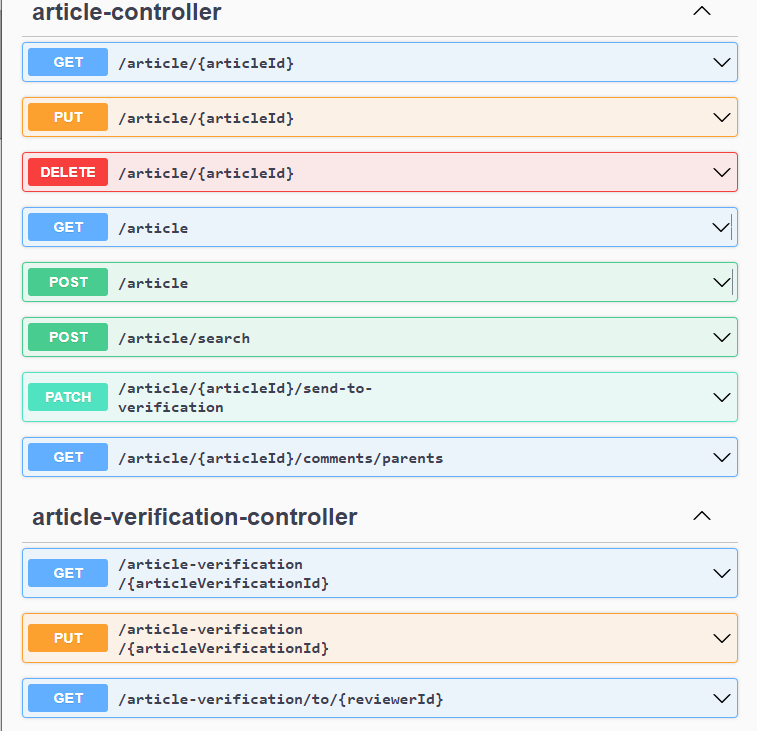
</p>

<p align="center">
    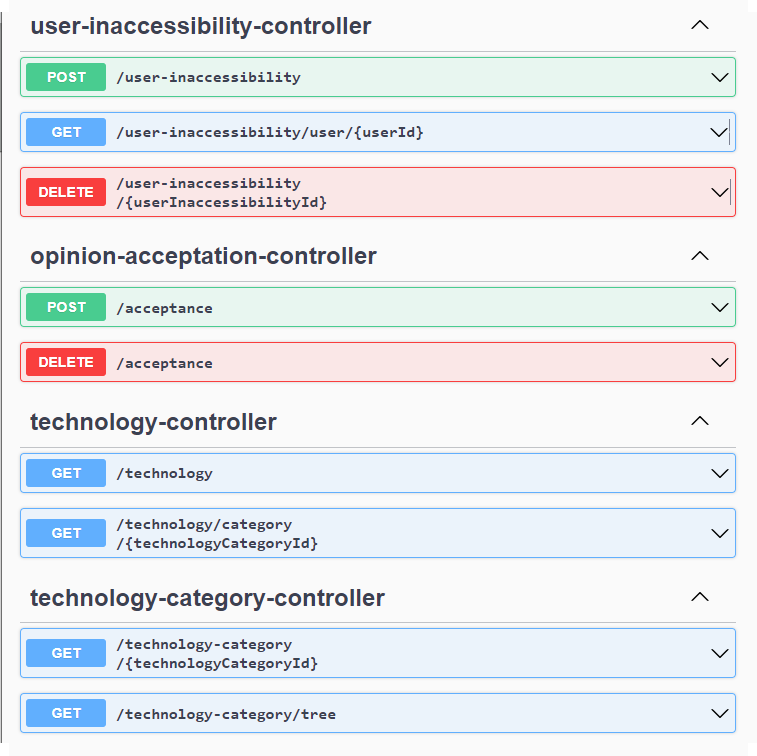
</p>

## Zrzuty ekranu:

### Rejestracja składa się z dwóch etapów: wprowadzenia danych osobowych oraz zaakceptowania regulaminu.

#### Niezalogowany użytkownik

##### Wprowadzenie danych osobowych:
<p align="center">
    
</p>

#### Dla najwazniejszych pól wejściowych przeprowadzana jest walidacja np. dla rejestracji:
<p align="center">
    
</p>

##### Akceptacja regulaminu:
<p align="center">
    
</p>

#### Został zaimplementowany system powiadomień informujący użytkownika o sukcesie albo wystąpieniu błędu. 

##### Np. przy pomyślnej rejestracji wyświetlany jest następujący komunikat:
<p align="center">
    
</p>

##### Przykładowy komunikat o błędzie wyświetlany w sytuacji wprowadzenia już istniejącego pseudonimu:
<p align="center">
    
</p>

##### Logowanie:
<p align="center">
    
</p>

### Zalogowany użytkownik

#### Dane użytkownika:
<p align="center">
    
</p>

#### Edycja danych użytkownika:
<p align="center">
    
</p>

#### Zmiana hasła:
<p align="center">
    
</p>

#### Wyszukiwanie artykułów:

##### Kryteria wyszukiwania
<p align="center">
    
</p>

#### Wyniki wyszukiwania:
<p align="center">
    
</p>

### Tworzenie / Edycja artykułu:

#### Wybór kategorii technologii:
<p align="center">
    
</p>

#### Wybór technologii należącej do wybranej kategorii:
<p align="center">
    
</p>

#### Tworzenie treści artykułu:
<p align="center">
    
</p>

#### Widok artykułu:
<p align="center">
    
</p>

#### Wygląd bloku kodu artykułu:
<p align="center">
    
</p>

#### Artykuł widziany przez autora:
<p align="center">
    
</p>

#### Usunięcie artykułu:
<p align="center">
    
</p>

#### Sekcja komentarzy:
<p align="center">
    
</p>

#### Sekcja z opiniami:
<p align="center">
    
</p>

### Recenzent

#### Dostępność - chęć recenzowania artykułów:

##### Ustawiona dostępność
<p align="center">
    
</p>

##### Ustawienie niedostępności:
<p align="center">
    
</p>

##### Ustawiona niedostępność:
<p align="center">
    
</p>

#### Weryfikacja artykułów:

##### Artykuły przypisane recenzentowi do weryfikacji:
<p align="center">
    
</p>

##### Widok weryfikacji:
<p align="center">
    
</p>

##### Formularz weryfikacji:
<p align="center">
    
</p>

##### Widok akceptacji artykułu widziany przez autora artykułu:
<p align="center">
    
</p>

##### Widok odrzucenia artykułu widziany przez autora artykułu:
<p align="center">
    
</p>

#### Administrator

##### Wyszukiwanie użytkowników:
<p align="center">
    
</p>

##### Zarządzanie danymi użytkownika:
<p align="center">
    
</p>
